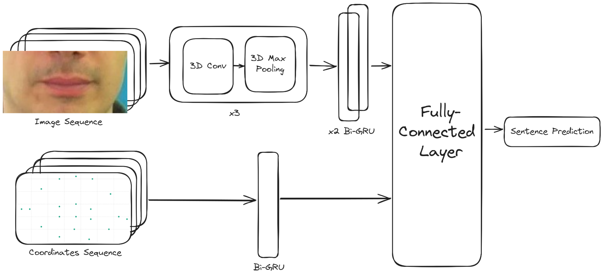
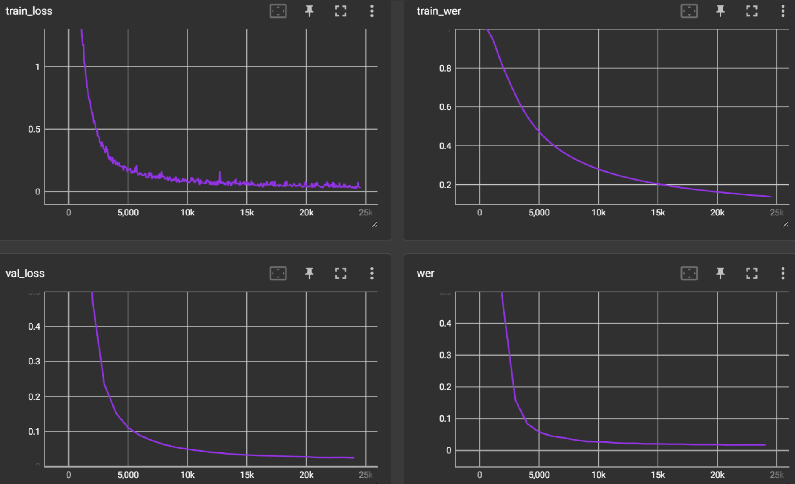

# LipCoordNet: Enhanced Lip Reading with Landmark Coordinates

## Introduction

Lipreading is an advanced neural network model designed for accurate lip reading by incorporating lip landmark coordinates as a supplementary input to the traditional image sequence input. This enhancement to the original LipNet architecture aims to improve the precision of sentence predictions by providing additional geometric context to the model.

## Features

- **Dual Input System**: Utilizes both raw image sequences and corresponding lip landmark coordinates for improved context.
- **Enhanced Spatial Resolution**: Improved spatial analysis of lip movements through detailed landmark tracking.
- **State-of-the-Art Performance**: Outperforms the original Lipreading, as well as  LipReading-final-year-project[ Implementation of LipReading](https://github.com/wissemkarous/Lip-reading-Final-Year-Project).
  | Scenario | Image Size (W x H) | CER | WER |
  | :-------------------------------: | :----------------: | :--: | :---: |
  | Unseen speakers (Original) | 100 x 50 | 6.7% | 13.6% |
  | Overlapped speakers (Original) | 100 x 50 | 2.0% | 5.6% |
  | Unseen speakers (LipReading-final-year-project) | 128 x 64 | 6.7% | 13.3% |
  | Overlapped speakers ( LipReading-final-year-project) | 128 x 64 | 1.9% | 4.6% |
  | Overlapped speakers (LipReading) | 128 x 64 | 0.6% | 1.7% |

## Getting Started

### Prerequisites

- Python 3.10 or later
- Pytorch 2.0 or later
- OpenCV
- NumPy
- dlib (for landmark detection)
- The detailed list of dependencies can be found in `requirements.txt`.

### Installation

1. Clone the repository:

   ```bash
   git clone https://huggingface.co/wissemkarous/LIPREAD
   ```

2. Navigate to the project directory:
   ```bash
   cd LipCoordNet
   ```
3. Install the required dependencies:
   ```bash
   pip install -r requirements.txt
   ```

### Usage

To train the LipReading model with your dataset, first update the options.py file with the appropriate paths to your dataset and pretrained weights (comment out the weights if you want to start from scratch). Then, run the following command:

```bash
python train.py
```

To perform sentence prediction using the pre-trained model:

```bash
python inference.py --input_video <path_to_video>
```

note: ffmpeg is required to convert video to image sequence and run the inference script.

## Model Architecture



## Training

This model is built on top of the [LipReading](https://github.com/wissemkarous/Lip-reading-Final-Year-Project) project on GitHub. The training process if similar to the original LipNet model, with the addition of landmark coordinates as a supplementary input. We used the pretrained weights from the original LipNet model as a starting point for training our model, froze the weights for the original LipNet layers, and trained the new layers for the landmark coordinates.

The dataset used to train this model is the [Lipreading dataset](https://huggingface.co/datasets/wissemkarous/lipreading). The dataset is not included in this repository, but can be downloaded from the link above.

Total training time: 12 h
Total epochs: 51
Training hardware: NVIDIA GeForce RTX 3050 6GB



For an interactive view of the training curves, please refer to the tensorboard logs in the `runs` directory.
Use this command to view the logs:

```bash
tensorboard --logdir runs
```

## Evaluation

We achieved a lowest WER of 1.7%, CER of 0.6% and a loss of 0.0256 on the validation dataset.

## License

This project is licensed under the MIT License.

## Acknowledgments

This model, LipReading, has been developed for academic purposes as a final year project. Special thanks to everyone who provided assistance and all references
## Contact

Project Link: https://github.com/wissemkarous/End-of-year-Project